# 🛒 Order Service API

> 주문 생성, 조회, 취소가 가능한 백엔드 서비스입니다.  
> JPA와 H2 DB 기반으로 RESTful API를 제공하며, Swagger 문서를 통해 API 테스트가 가능합니다.

---

## ✅ 주요 기능

### 1. 주문 생성 API [POST]
- 상품 ID (productId) 와 수량 (quantity) 리스트를 입력받아 주문을 생성합니다.
- 주문 ID (orderId), 각 상품의 실구매 금액 리스트 (items), 주문 전체 금액 (totalAmount) 을 반환합니다.
- 재고가 부족하면 주문이 실패하며, 주문 생성 시 재고가 차감됩니다.

📸 주문 생성 Swagger 캡처

<p align="center">
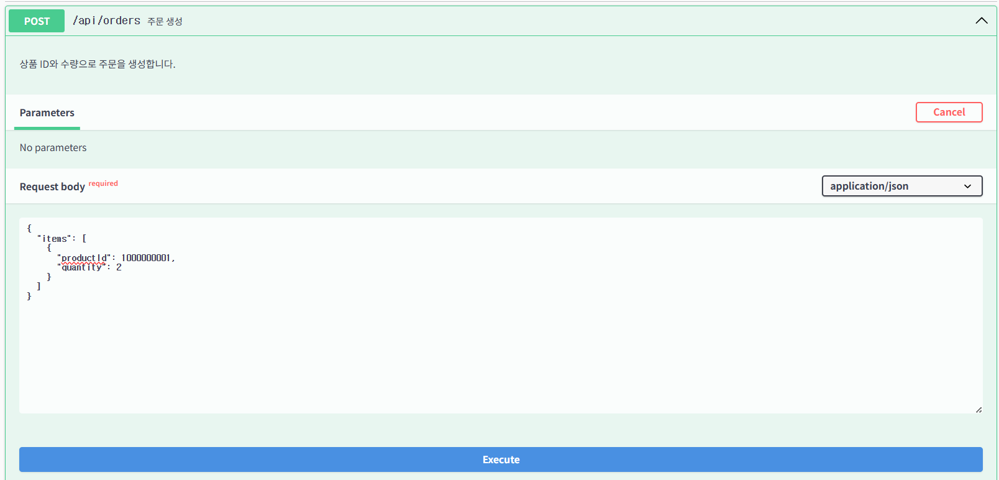
</p>
<p align="center">
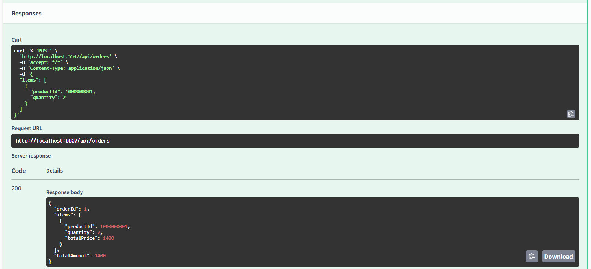
</p>

📸 주문 생성 테스트 UI 캡처

<p align="center">
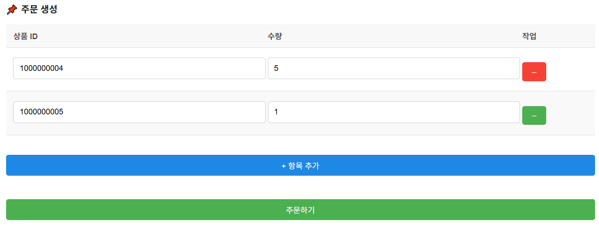
</p>
<p align="center">
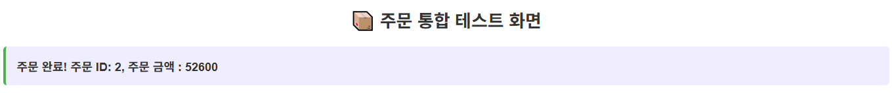
</p>

---

### 2. 주문 상품 개별 취소 API [DELETE]
- 주문번호 (orderId) 와 취소할 개별 상품 ID (productId) 를 입력받아 해당 상품을 취소합니다.
- 취소된 상품 정보 (Id, Name), 환불 금액 (refundAmount), 취소 후 남은 전체 주문 금액 (remainingTotalAmount) 을 반환합니다.
- 재고는 복구되며, 이미 취소된 상품이나 잘못된 ID 요청 시 에러 처리됩니다.

📸 주문 상품 취소 Swagger 캡처  

<p align="center">
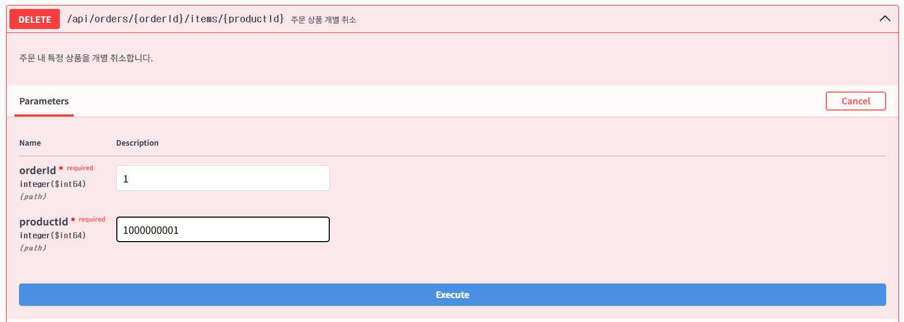
</p>
<p align="center">
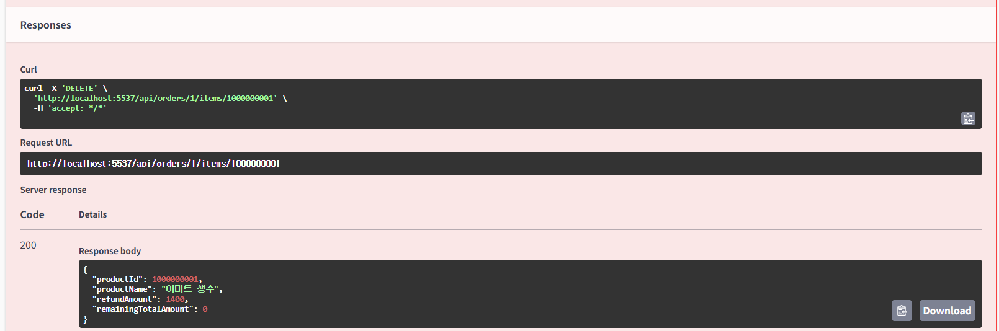
</p>

📸 주문 상품 취소 테스트 UI 캡처  

<p align="center">
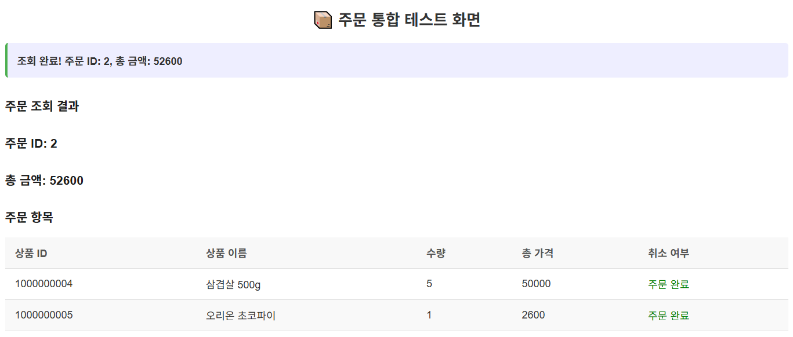
</p>
<p align="center">
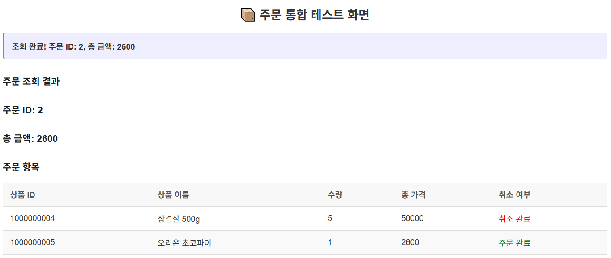
</p>

---

### 3. 주문 조회 API [GET]
- 주문번호 (orderId) 를 입력받아 주문된 상품들의 정보 (items), 주문 금액 (totalAmount) 을 반환합니다.
- 존재하지 않는 주문번호 입력 시 에러 처리됩니다.

📸 주문 조회 Swagger 캡처  

<p align="center">
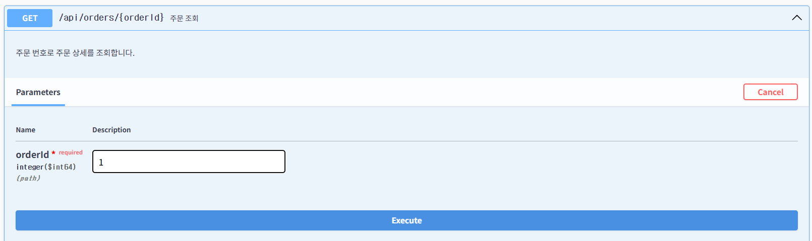
</p>
<p align="center">
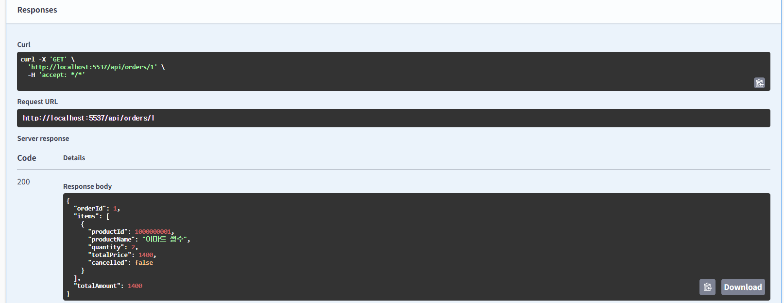
</p>

---

# 📦 프로젝트 구조

## 1. 📁 **config** - 설정 관련 파일들
- `📄 DataInitializer.java`  : 초기 데이터 로딩 설정 클래스
- `📄 SwaggerConfig.java`    : Swagger API 문서 간편 설정 클래스

## 2. 🌐 **controller** - 웹 요청을 처리하는 컨트롤러
- `📄 OrderController.java`  : 주문 관련 API 컨트롤러
- `📄 ProductController.java` : 상품 재고 관련 API 컨트롤러
- `🖼️ OrderUiController.java` : 주문 UI 테스트용 HTML 컨트롤러

## 3. 🏷️ **domain** - 도메인 모델 (엔티티)
- `📄 Order.java`            : 주문 엔티티
- `📄 OrderItem.java`        : 주문 상품 (Detail) 엔티티
- `📄 Product.java`          : 상품 엔티티

## 4. 🗂️ **dto** - 데이터 전송 객체 (DTO)
- `🧾 OrderRequestDto.java`  : 주문 요청 DTO
- `🧾 OrderResponseDto.java` : 주문 응답 DTO
- `🧾 CancelOrderItemResponseDto.java` : 취소 응답 DTO
- `🧾 OrderDetailResponseDto.java` : 조회 응답 DTO
- `🧾 ProductResponseDto.java` : 재고 응답 DTO

## 5. 💥 **exception** - 예외 처리
- `📄 GlobalExceptionHandler.java` : 전역 예외 처리 핸들러

## 6. 🧠 **service** - 비즈니스 로직
- `📄 OrderService.java`      : 주문 비즈니스 로직

## 7. 🧪 **test** - 테스트 코드
- `📄 OsapiApplicationTests.java` : JUnit 테스트

## 8. 📄 **resources** - 리소스 파일
- `📄 application.yml`        : 애플리케이션 설정 파일
- `🖼️ templates/order-ui.html` : 주문 UI 테스트

## 9. 🛠️ **기타 파일**
- `📄 build.gradle`           : Gradle 빌드 설정 파일


---

## ⚙️ 기술 스택

- **Java 17**
- **Spring Boot 3.2.5**
- **Spring Data JPA**
- **H2 In-Memory Database**
- **Swagger UI**
- **JUnit + Mockito**

---

## 🧪 JUnit 테스트 코드

- 서비스 로직 중심의 단위 테스트 및 통합 테스트 작성
- 재고 부족, 주문 취소 등 예외 상황도 포함한 테스트 시나리오 구성

<p align="center">
    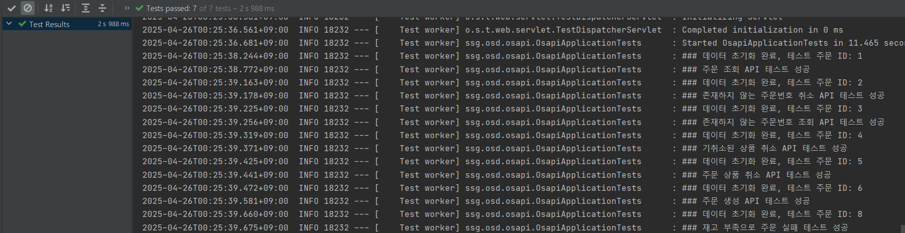
</p>

<details>
<summary>📄 테스트 예시 보기</summary>

```java
@Test
@DisplayName("주문 조회 API - 정상 조회")
void getOrder_Success() throws Exception {
    mockMvc.perform(get("/api/orders/{orderId}", testOrderId))
           .andExpect(status().isOk())
           .andExpect(jsonPath("$.orderId").value(testOrderId));
}
```

</details>

---

## 📑 API 문서 (Swagger)

- `http://localhost:5537/swagger-ui/index.html`
- 모든 필수 API에 대한 요청/응답 예시 및 설명이 포함되어 있습니다.

---

## 🗂 테스트 URL
- H2 Console : http://localhost:5537/h2-console/login.jsp
<p align="center">
  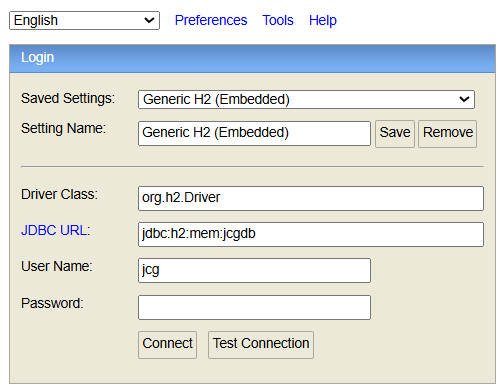
</p>
- Swagger Web : http://localhost:5537/swagger-ui/index.html
<p align="center">
  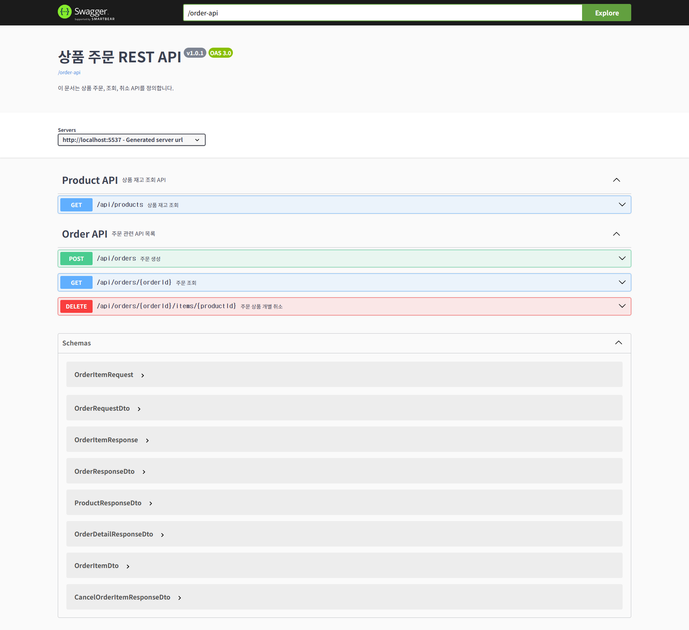
</p>
- 통합 주문 UI : http://localhost:5537/ui
<p align="center">
  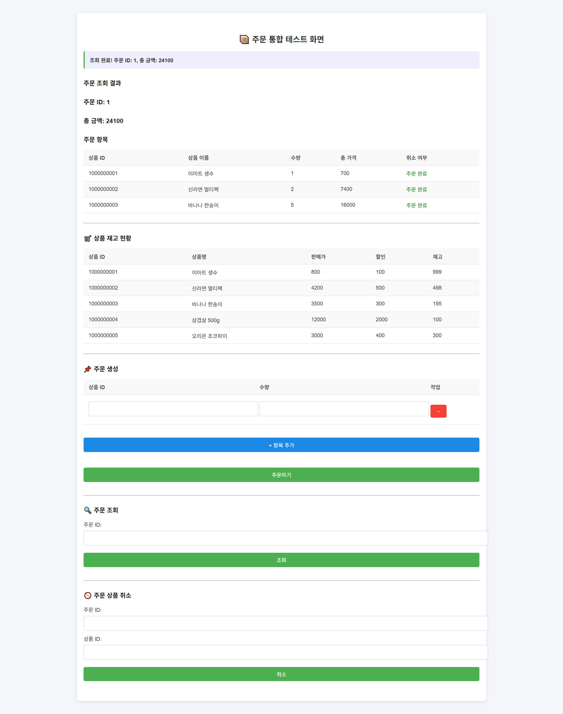
</p>